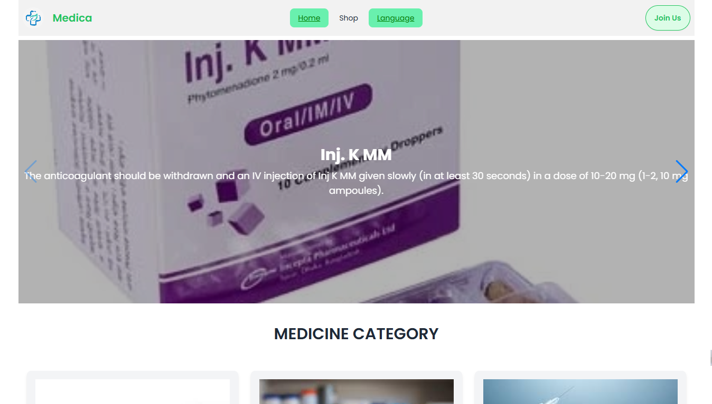

Here’s the `README.md` for **MEDICA**, formatted in the style you requested:  

---

# 🏥 **MEDICA**  


MEDICA is a modern, dynamic e-commerce platform designed for purchasing medicines online. It offers a seamless user experience with secure authentication, efficient medicine management, and intuitive dashboards for sellers and administrators. With features like private routes, real-time notifications, integrated payments, and advanced search & sort functionalities, MEDICA ensures a smooth and reliable healthcare shopping experience for all users.  

---

## 🚀 **Live Demo**  
[Live Site: MEDICA](#) *(https://medica-store-d867a.web.app/)*  

---

## 📖 **Table of Contents**  
- [✨ Features](#-features)  
- [🛠️ Technology Stack](#️-technology-stack)  
- [⚙️ Installation](#️-installation)  
- [🔑 Configuration (.env)](#-configuration-env)  
- [🚀 Usage](#-usage)  
- [📊 Admin & Seller Dashboards](#-admin--seller-dashboards)  
- [🤝 Contributing](#-contributing)  
- [📄 License](#-license)  

---

## ✨ **Features**  

- **Swiper Slider** – Showcase discounted medicines on the homepage with an interactive slider.  
- **Dynamic Routing** – Navigate between pages like Home, Shop, and more without reloading.  
- **View Details (Eye Button)** – Click the eye icon to view detailed medicine information in a modal.  
- **Private Route Protection** – Secure routes like Cart, Payment History, and Profile Updates for logged-in users only.  
- **Toastify Alerts** – Real-time feedback for login, logout, and other user actions.  
- **Dynamic Rendering Links** – Context-based navigation like "Join Us" or "Register" based on user flow.  
- **React Hook Form Integration** – Streamlined form handling for user registration, adding medicines, and updating categories.  
- **Seller & Admin Dashboards** –  
  - **Seller:** Manage medicines, track payment details.  
  - **Admin:** View total revenue, manage users, sellers, payments, and more.  
- **Additional Homepage Sections** – "Why Choose Us" and "Newsletter" sections for better user engagement.  
- **Search, Sort & Pagination** – Efficient management of medicine listings with advanced filtering capabilities.  

---

## 🛠️ **Technology Stack**  

| **Category**         | **Technologies Used**                      |
|----------------------|-------------------------------------------|
| **Frontend**         | React, Vite, Tailwind CSS, DaisyUI        |
| **State Management** | React Query                               |
| **Forms**            | React Hook Form                           |
| **Routing**          | React Router DOM                          |
| **Backend**          | Firebase (Authentication, Firestore) ,MongoDb, ExpressJs  |
| **Payments**         | Stripe                                    |
| **Notifications**    | React Hot Toast, SweetAlert2              |
| **PDF Generation**   | jsPDF, jsPDF-AutoTable                    |
| **Search & Sort**    | Match Sorter, Sort-By                     |
| **Deployment**       | *(Specify here if deployed on Vercel, Netlify, etc.)* |  

---

## ⚙️ **Installation**  

### **Prerequisites**  
- Node.js (>= 18)  
- npm (or yarn)  
- Firebase Project  
- Stripe Account  

### **Steps**  
1. **Clone the Repository**  
   ```bash
   git clone https://github.com/Md-SayeedAlam/Medica-ecommerce-website-client-side.git
   cd medica
   ```  
2. **Install Dependencies**  
   ```bash
   npm install
   ```  
3. **Set Up Environment Variables** (Refer to `.env` configuration below)  
4. **Run the Development Server**  
   ```bash
   npm run dev
   ```  

---

## 🔑 **Configuration (.env)**  

Create a `.env` file in the root directory and add the following environment variables:  

```env
# Firebase Configuration
VITE_apiKey=
VITE_authDomain=
VITE_projectId=
VITE_storageBucket=
VITE_messagingSenderId=
VITE_appId=

# Image Hosting Key
VITE_IMAGE_HOSTING_KEY=Use your image hosting key

# Stripe Payment Gateway
VITE_Payment_gateway_PK=Use your stripe key
```  

> 🚨 **Important:** Never expose your `.env` file in public repositories. Ensure it's included in `.gitignore`.  

---

## 🚀 **Usage**  

1. **Browse Medicines:** Explore the homepage with dynamic sliders and featured medicines.  
2. **Search & Sort:** Filter medicines using search and sort functionalities.  
3. **View Details:** Click the eye icon to view detailed information in a modal.  
4. **Secure Actions:** Log in to access private routes like Cart, Payment History, and Profile Settings.  
5. **Checkout:** Add items to the cart and complete purchases securely via Stripe.  
6. **Notifications:** Receive instant feedback through Toastify alerts for actions like login, registration, and payment.  

---

## 📊 **Admin & Seller Dashboards**  

### **Admin Panel:**  
- **Dashboard Metrics:** Track revenue, user statistics, and payment details.  
- **User Management:** View and manage sellers, customers, and orders.  
- **Revenue Insights:** Analyze performance with comprehensive reports.  

### **Seller Panel:**  
- **Manage Products:** Add, update, and delete medicines.  
- **Payment Tracking:** View payment history for sold items.  

### 🧪 **Demo Credentials:**  
- **Admin:** `admin@admin.com` / `123456Ll*`  
- **Seller:** `lalasowrav@gmail.com` / `123456Ll*`  
- **User:** `ko@ko.com` / `123456Ll*`  

---

## 🤝 **Contributing**  

Contributions are welcome! 🚀  
1. Fork the repository  
2. Create your feature branch (`git checkout -b feature/YourFeature`)  
3. Commit your changes (`git commit -m 'Add Your Feature'`)  
4. Push to the branch (`git push origin feature/YourFeature`)  
5. Open a pull request  

---
##  **Dependencies**  
"dependencies": {
    "@headlessui/react": "^2.2.0",
    "@stripe/react-stripe-js": "^3.1.1",
    "@stripe/stripe-js": "^5.5.0",
    "@tanstack/react-query": "^5.64.1",
    "axios": "^1.7.9",
    "firebase": "^11.1.0",
    "jspdf": "^2.5.2",
    "jspdf-autotable": "^3.8.4",
    "localforage": "^1.10.0",
    "lottie-react": "^2.4.0",
    "match-sorter": "^8.0.0",
    "react": "^18.3.1",
    "react-dom": "^18.3.1",
    "react-helmet-async": "^2.0.5",
    "react-hook-form": "^7.54.2",
    "react-hot-toast": "^2.5.1",
    "react-icons": "^5.4.0",
    "react-router-dom": "^7.1.1",
    "react-to-print": "^3.0.4",
    "sort-by": "^1.2.0",
    "stripe": "^17.5.0",
    "sweetalert2": "^11.15.10",
    "swiper": "^11.2.1",
    "xlsx": "^0.18.5"
  },
  "devDependencies": {
    "@eslint/js": "^9.17.0",
    "@types/react": "^18.3.18",
    "@types/react-dom": "^18.3.5",
    "@types/xlsx": "^0.0.35",
    "@vitejs/plugin-react": "^4.3.4",
    "autoprefixer": "^10.4.20",
    "daisyui": "^4.12.23",
    "eslint": "^9.17.0",
    "eslint-plugin-react": "^7.37.2",
    "eslint-plugin-react-hooks": "^5.0.0",
    "eslint-plugin-react-refresh": "^0.4.16",
    "globals": "^15.14.0",
    "postcss": "^8.4.49",
    "tailwindcss": "^3.4.17",
    "vite": "^6.0.5"
  }


---
## 📄 **License**  

This project is licensed under the [MIT License](LICENSE).  

---

> 🚀 Enjoy a seamless online medical shopping experience with **MEDICA**! 💊💙
